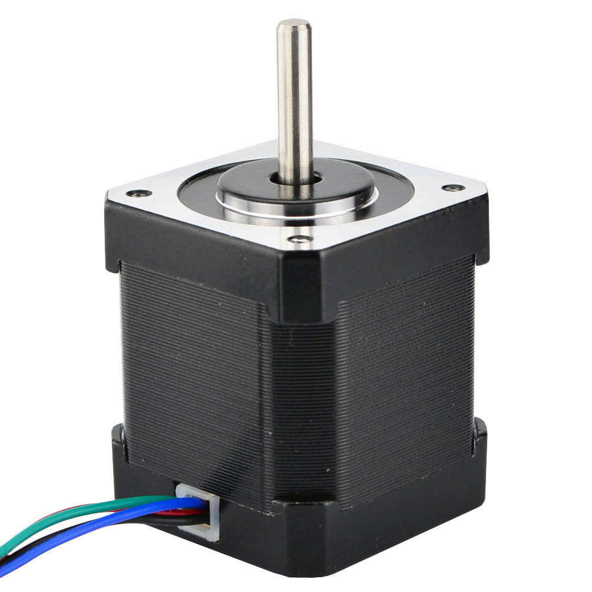
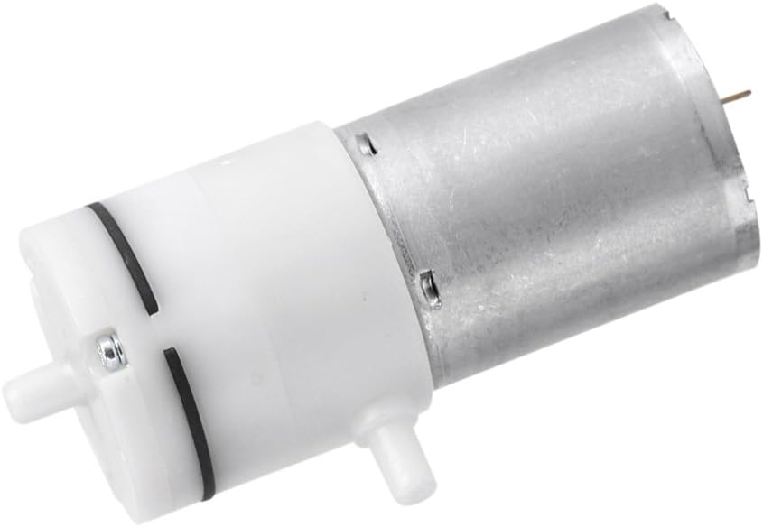
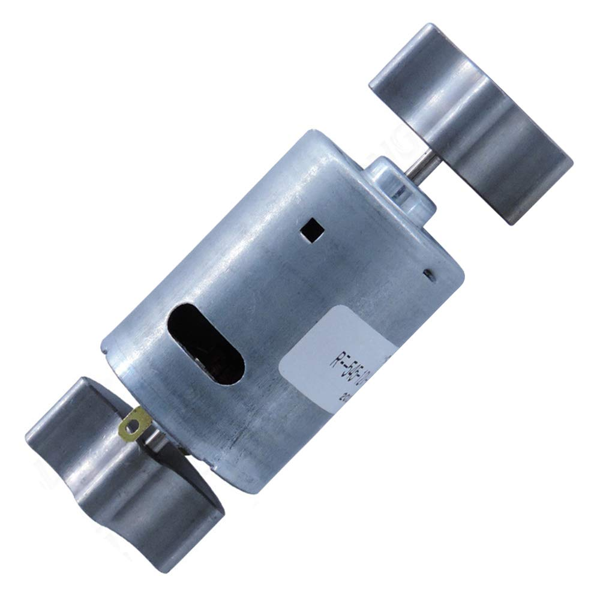
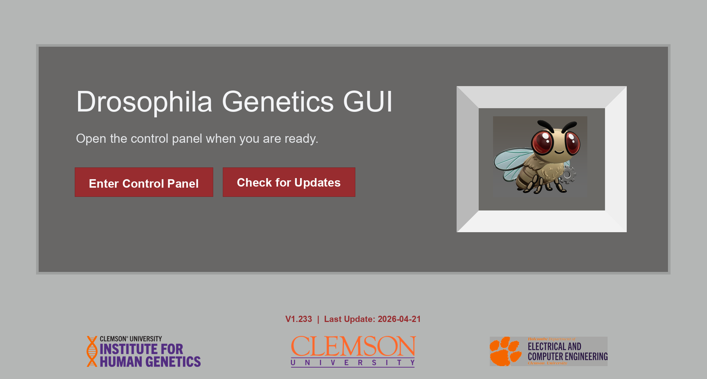
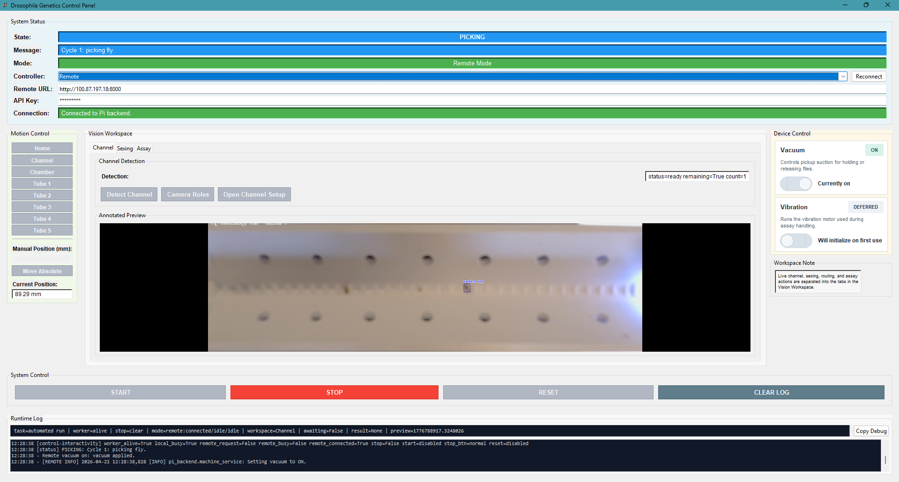
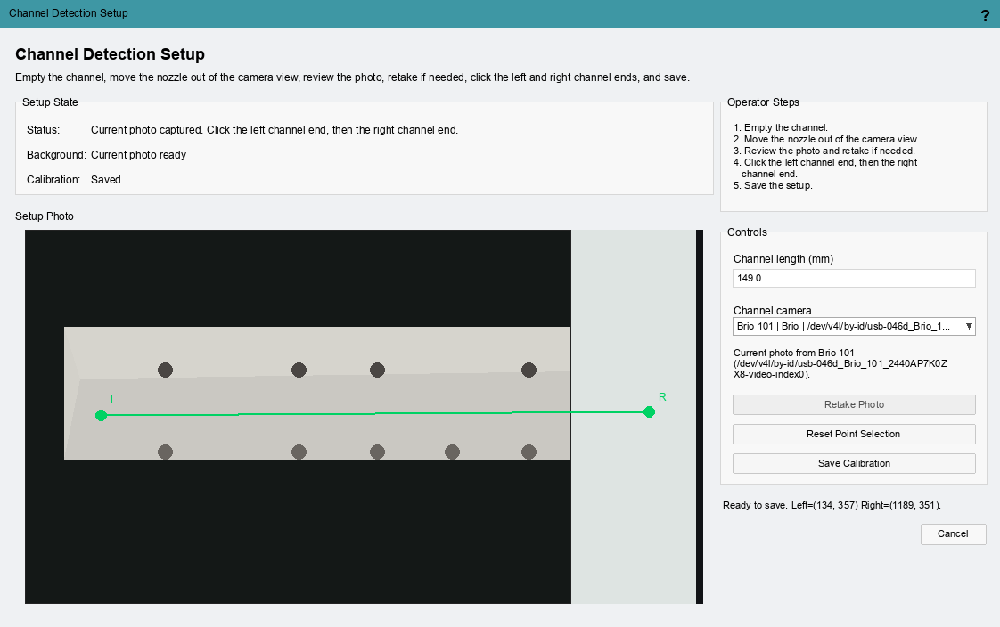

<h1>
  Automated Drosophila Sorting System
  
</h1>

**Automated Drosophila Sorting System** is a mixed hardware, embedded-control, computer-vision, and desktop-software project for detecting, picking, classifying, and sorting **Drosophila melanogaster** with minimal operator intervention.

This repository contains the actual working project code:

- **Raspberry Pi machine control**
- **Desktop GUI control**
- **Computer vision and channel-detection code**
- **Backend API and runtime-state architecture**
- **Control, vision, and support modules used by the system**

It should be read as a real electromechanical system codebase, not just a GUI project and not just an API project.

## **Overview**

The system is designed to automate the pipeline from mixed fly input to classified tube output.

**Intended operating loop:**

1. Flies are loaded into the channel.
2. A camera captures the channel image.
3. Computer vision detects fly positions.
4. The system selects the next target.
5. The gantry moves to the pickup location.
6. Vacuum captures the fly.
7. The fly is moved to an identification chamber.
8. Classification or assay logic runs.
9. The fly is placed into the correct output tube.
10. The gantry continues from its known absolute position or returns to a commanded safe position.
11. The cycle repeats until no flies remain.

**Target system goals:**

- `>= 4` flies processed per minute
- `>= 99%` survival rate
- `< 1%` sorting error
- Continuous operation across roughly `20` output tubes without intervention

## **System Architecture**

### **Hardware Layer**

The hardware stack includes:

- **Raspberry Pi 5** or similar Pi-class controller
- **X-axis gantry**
- **Motor systems:** NEMA stepper motor, TMC2208 stepper driver, and vacuum pickup system
- **Eccentric vibration motor**
- **Limit switches** for homing/reference
- **Top-down camera**
- **Custom PCB support** for motor-driver interfacing, power distribution, and GPIO breakout/control

### **Motor Systems**

The system uses three motor-driven subsystems:

- **Gantry Stepper Motor**
  - Drives X-axis motion for homing, positioning, pickup, and tube placement
  <p align="center">
    
  </p>
  <p align="center">
    <em>NEMA stepper motor used for gantry motion.</em>
  </p>
- **Vacuum Motor**
  - Provides suction for fly pickup through the nozzle system
  <p align="center">
    
  </p>
  <p align="center">
    <em>Vacuum motor used for nozzle suction.</em>
  </p>
- **Vibration Motor**
  - Drives vibration-based redistribution and assay-related motion
  <p align="center">
    
  </p>
  <p align="center">
    <em>Vibration motor used for redistribution and assay motion.</em>
  </p>

### **Software Layer**

The software stack includes:

- **Python-based control** on the Raspberry Pi
- **Motion control** and homing logic
- **Vacuum and vibration control**
- **Computer vision / detection pipeline**
- **Desktop GUI** for operator interaction
- **FastAPI backend** for remote operation
- **Shared runtime state** and controller abstractions

### **Responsibility Split**

The repository is structured around this separation:

- **Pi backend**
  - Owns hardware control
  - Owns runtime truth
  - Executes machine tasks
  - Exposes API endpoints

- **Host GUI**
  - Owns operator interaction
  - Sends commands to the Pi
  - Polls backend state
  - Displays logs, status, actuator state, and preview data

**Communication model:** FastAPI + HTTP in remote mode.

## **System Functions**

The system provides the following functions in the codebase:

- **Remote GUI control** from host to Pi
- **Homing**
- **Manual movement**
- **Vacuum control**
- **Vibration control**
- **Classify requests** through the controller/API path
- **Assay requests** through the controller/API path
- **Reconnect and retry handling**
- **Remote calibration confirmation** before controls unlock
- **Remote preview image fetch** from Pi-generated artifacts
- **Remote channel setup and camera-role selection**
- **Remote Integrated3 assay workspace**
- **Remote assay calibration/configuration**
- **Remote assay recording, processing, graph/PDF generation, and Box upload**
- **Scrollable in-GUI assay report viewer** for graph and raw-data PDFs
- **Degraded backend startup** when some subsystems are unavailable
- **Local / simulation-capable behavior** preserved
- **Manual control validated on real hardware**

## **How It Works**

**Remote-mode flow:**

`GUI -> Controller -> FastAPI API -> Machine Service -> Hardware / CV logic -> Runtime State -> GUI`

### **System Workflow Diagram**

<p align="center">
  
</p>

**Operationally:**

1. The operator launches the GUI.
2. The GUI connects to the Pi backend.
3. Startup/setup/manual homing establishes the motion reference.
4. Commands are sent through a controller abstraction.
5. The Pi backend validates and executes the task.
6. Backend state is updated as the task progresses.
7. The GUI polls `/status`.
8. The GUI updates position, state, logs, actuator status, and preview display.

**Important current motion policy:** physical homing is allowed for startup/setup/manual reference recovery, but normal automated operation should use known absolute positions and explicit commanded moves. If the absolute reference is lost during operation, the run should fail cleanly to a restartable safe idle state rather than repeatedly homing inside the active loop.

### **Integrated3 Assay Path**

The assay side is now wired around **`CodeDirectory/Integrated3`**. Its `fin6/fly_tracking_gui.py`, `fin6/assay_*` modules, and `stitch_operator` services are treated as the reference implementation for assay behavior.

Current remote assay architecture:

`Host Assay Workspace -> RemoteController -> FastAPI /fin6/assay/* routes -> MachineService -> operator_bridge -> Integrated3 fin6 / stitch_operator code`

The host GUI provides a dedicated full-page assay workspace rather than forcing assay controls into the narrow channel-preview layout. It includes:

- Guided assay calibration/configuration with background capture, tube-region drawing, save, and test
- Pi-side assay preview modes: calibration, background, transform, annotated, mask, and raw
- Run assay recording, process latest/selected/batch, and upload/export actions
- Graph PDF and full report PDF generation
- A separate scrollable report viewer window with a **Graphs** tab first and a **Raw Data / Full Report** tab second
- Debug-only controls for processing/upload settings and developer inspection

## **Repository Structure**

This repository contains the backend, GUI, shared definitions, hardware-control code, and vision code that make up the working system.

```text
geneticsdrosophilaproject/
|- .github/
|  `- assets/
|     |- Complete3-D ModelM2.png
|     |- Drosophilia_Core_PCB_2.png
|     |- Full-System-Integration.png
|     |- GUI-Loading-Page.png
|     `- drosophila.png
|- .drosophila_remote_gui.example.json
|- README.md
|- assets/
|- CodeDirectory/
|  `- Integrated3/
|     |- CodeDirectory/
|     |  |- gui.py
|     |  |- motion.py
|     |  |- gantryOperation.py
|     |  |- vacuum.py
|     |  |- vibration.py
|     |  `- fly_classifier.py
|     |- fin6/
|     |  |- fly_tracking_gui.py
|     |  |- assay_recording.py
|     |  |- assay_processing.py
|     |  |- assay_tracking.py
|     |  |- assay_profile.py
|     |  |- background_manager.py
|     |  |- box_upload.py
|     |  |- camera_sources.py
|     |  `- tests/
|     `- stitch_operator/
|        |- app.py
|        |- services/
|        `- runtime/
|- host_app/
|  |- controllers/
|  |- gui/
|  |  |- gui.py
|  |  |- channel_setup_panel.py
|  |  |- camera_role_panel.py
|  |  `- remote_assay_workspace.py
|  |- launchers/
|  `- sync/
|- pi_backend/
|  |- adapters/
|  |- api/
|  |- control/
|  |- core/
|  `- legacy_pi/
|- pi_app/
|  `- legacy_pi/
|     |- FinalOperation.py
|     |- motion.py
|     |- vacuum.py
|     `- vibration.py
|- requirements/
|  |- host_requirements.txt
|  `- pi_requirements.txt
|- shared/
|  |- debug/
|  |- config/
|  `- state/
|- vision/
|  `- fin6/
|     |- brio_channel_cli.py
|     |- fly_x_detector.py
|     |- run_detection_once.py
|     |- camera_sources.py
|     |- requirements.txt
|     `- outputs/
|- deployment/
|  `- pi/
|     `- config/
|        `- backend.env.example
`- Avi Detection GUI code/
   `- earlier assay/reference implementations
```

## **Codebase Breakdown**

### **`CodeDirectory/`**

This directory now primarily contains the **Integrated3** assay reference stack and the earlier integrated control modules that it depends on.

### **`CodeDirectory/Integrated3/`**

`Integrated3` is the current ground-truth assay implementation. The remote system should mirror this behavior through the Pi backend API rather than bypassing it with local-only host logic.

**Important areas:**

- **`CodeDirectory/Integrated3/fin6/fly_tracking_gui.py`**
  - Reference GUI behavior for assay preview, calibration, processing, playback, and export
- **`CodeDirectory/Integrated3/fin6/assay_recording.py`**
  - Assay recording and vibration-assisted run capture
- **`CodeDirectory/Integrated3/fin6/assay_processing.py`**
  - Processing pipeline for raw assay videos, annotated/mask outputs, CSVs, JSON, graph PDFs, and report PDFs
- **`CodeDirectory/Integrated3/fin6/assay_tracking.py`**
  - Tracking, graph generation, PDF report generation, and assay summary calculations
- **`CodeDirectory/Integrated3/fin6/box_upload.py`**
  - Box upload support for raw videos, processed videos, PDFs, graph artifacts, CSV/JSON summaries, and optional full-session uploads
- **`CodeDirectory/Integrated3/stitch_operator/`**
  - Service layer used by the remote bridge for profile, background, calibration, run, processing, and upload behavior

#### **GUI Screens**

The desktop GUI currently includes a dedicated loading / landing page that serves as the operator entry point before opening the control panel. It presents the main access action, update-check workflow, version/date metadata, and project branding in a simplified startup view.

<p align="center">
  
</p>
<p align="center">
  <em>Loading / landing page of the desktop GUI.</em>
</p>

The current application also includes the primary operator control panel used for status monitoring, manual gantry movement, device toggling, preview inspection, and direct operation access.

<p align="center">
  
</p>
<p align="center">
  <em>Channel View.</em>
</p>

<p align="center">
  
</p>
<p align="center">
  <em>Channel Calibration Menu.</em>
</p>

The current host GUI also includes:

- Channel setup and calibration panels
- Camera-role selection for channel/sexing/assay cameras
- Sexing/classification preview and result display
- Full-page remote assay workspace
- Assay calibration/config window with tube-region drawing
- Assay debug/settings window
- Assay report viewer window for scrollable PDFs

**Important files:**

- **`host_app/gui/gui.py`**
  - Main remote-capable desktop GUI
- **`host_app/gui/remote_assay_workspace.py`**
  - Full-page assay workspace, guided calibration/configuration, debug settings, processing/export controls, and scrollable report viewer
- **`host_app/controllers/remote_controller.py`**
  - Explicit host-side methods for every remote API route used by the GUI
- **`host_app/operator_bridge.py`**
  - Bridge from backend service calls into Integrated3 fin6/stitch-operator behavior

### **`pi_backend/`**

The Raspberry Pi backend architecture.

**Subdirectories:**

- **`api/`**
  - FastAPI app, routes, auth, models
- **`core/`**
  - Runtime state, config, logging bridge
- **`control/`**
  - Machine service, assay service, classify service
- **`adapters/`**
  - Motion, vacuum, vibration, and detection/result adapters

The backend owns the hardware-facing task execution and exposes remote routes for motion, vacuum, vibration, classification, channel detection, channel setup, camera roles, and the Integrated3 assay pipeline.

### **`host_app/`**

Host-side support code for remote GUI operation.

**Subdirectories:**

- **`controllers/`**
  - Base controller
  - Local controller
  - Remote controller
- **`sync/`**
  - Connection state
  - Remote polling/sync logic
- **`gui/`**
  - Main GUI, channel setup panel, camera-role panel, and full-page remote assay workspace
- **`launchers/`**
  - OS-specific GUI launcher helpers

**Local config behavior:**

- **`.drosophila_remote_gui.example.json`**
  - Tracked example for GUI connection defaults
- **`.drosophila_remote_gui.json`**
  - Machine-local GUI settings written by the application
  - Intentionally untracked

### **`shared/`**

Shared project definitions used by both sides.

**Includes:**

- Machine path definitions
- Network config
- Shared state enums

### **`vision/fin6/`**

Computer vision and channel-detection code. The current assay ground truth lives under `CodeDirectory/Integrated3/fin6`; `vision/fin6` remains important for channel detection, camera support, and shared vision utilities.

**Important files:**

- **`fly_tracking_gui.py`**
- **`brio_channel_cli.py`**
- **`fly_x_detector.py`**
- **`run_detection_once.py`**
- **`assay_tracking.py`**
- **`camera_sources.py`**

This area handles:

- Detection result generation
- Annotated preview image generation
- Channel output artifacts
- Camera integration support

## **Computer Vision / Output Artifacts**

Important channel generated files include:

- **`vision/fin6/outputs/channel/last_channel_result.json`**
- **`vision/fin6/outputs/channel/last_channel_annotated.png`**
- **`vision/fin6/outputs/channel/last_channel_mask.png`**

These are used for:

- Fly-position detection output
- Annotated preview display
- Remote GUI preview fetch from the Pi

Important Integrated3 assay generated files include:

- **`raw_video.mp4` / `raw_video.avi`**
- **`processed/annotated_video.mp4` / `processed/annotated_video.avi`**
- **`processed/mask_video.mp4` / `processed/mask_video.avi`**
- **`processed/report.pdf`**
- **`processed/graphs_report.pdf`**
- **`processed/graphs/*.png`**
- **`processed/per_vial_summary.csv`**
- **`processed/per_fly_summary.csv`**
- **`processed/latest_processing.json`**

The host assay workspace can fetch these artifacts from the Pi. The report viewer opens the graph PDF first and the full report/raw-data PDF second.

## **Local Configuration**

Machine-specific runtime settings are kept outside tracked source files where possible.

- **`deployment/pi/config/backend.env.example`**
  - Tracked example for Pi backend configuration
- **`deployment/pi/config/backend.env`**
  - Machine-local backend override file
  - Intentionally untracked
- **`.drosophila_remote_gui.example.json`**
  - Tracked example for host GUI connection defaults
- **`.drosophila_remote_gui.json`**
  - Machine-local host GUI settings file
  - Intentionally untracked
- **`CodeDirectory/Integrated3/fin6/profiles/*.json`**
  - Assay profile definitions for Integrated3/stitch-operator behavior
- **`CodeDirectory/Integrated3/fin6/.fly_tracking_gui_settings.json`**
  - Local Integrated3 GUI/runtime settings
- **Assay runtime outputs**
  - Backgrounds, processed runs, generated videos, PDFs, graph PNGs, Box upload manifests, and latest-run pointers are runtime artifacts and should be treated separately from source code.

## **API Endpoints**

Current backend endpoint groups include:

### **Health / Runtime State**

- **`GET /health`**
  - Backend liveness and subsystem readiness
- **`GET /status`**
  - Full runtime state for the GUI

### **Channel / Classification Artifacts**

- **`GET /artifacts/channel/annotated`**
  - Latest annotated channel preview image
- **`GET /artifacts/channel/background`**
  - Latest channel background image
- **`GET /artifacts/channel/setup_preview`**
  - Latest channel setup preview image
- **`GET /artifacts/classification/latest`**
  - Latest classification preview image

### **Motion / Actuator Control**

- **`POST /home`**
  - Home the gantry
- **`POST /move_absolute`**
  - Move to an absolute position
- **`POST /move_relative`**
  - Move by a relative distance
- **`POST /vacuum`**
  - Turn vacuum on/off
- **`POST /vibration`**
  - Turn vibration on/off
- **`POST /stop`**
  - Request stop of the active backend task

### **Automation / Vision Tasks**

- **`POST /classify`**
  - Run classification workflow
- **`POST /detect_channel`**
  - Run Pi-side fin6 channel detection
- **`POST /run_assay`**
  - Legacy/simple assay command path

### **Channel Setup / Camera Roles**

- **`GET /channel_setup/cameras`**
  - Discover Pi-side channel setup camera candidates
- **`GET /camera_roles`**
  - Read selected channel, sexing, and assay camera roles
- **`POST /camera_roles`**
  - Save selected camera roles
- **`POST /channel_setup/select_camera`**
  - Select the Pi-side channel setup camera
- **`POST /channel_setup/capture_background`**
  - Capture channel setup background
- **`POST /channel_setup/capture_preview`**
  - Capture channel setup preview
- **`POST /channel_setup/save_calibration`**
  - Save channel calibration points and channel length

### **Integrated3 Assay Setup / Status**

- **`GET /fin6/setup_status`**
  - Read whether Pi-side fin6 setup/background/calibration state exists
- **`POST /fin6/launch_setup`**
  - Launch the Pi-side fin6 setup GUI when needed
- **`GET /fin6/assay/status`**
  - Read Integrated3 assay availability and runtime status
- **`GET /fin6/assay/profile_summary`**
  - Read active assay profile and settings summary
- **`GET /fin6/assay/profiles`**
  - List available assay profiles
- **`POST /fin6/assay/profile/activate`**
  - Activate an assay profile
- **`POST /fin6/assay/profile/patch`**
  - Patch assay profile settings from the host debug/settings UI

### **Integrated3 Assay Background / Preview / Calibration**

- **`POST /fin6/assay/background/capture`**
  - Capture a clean assay background on the Pi
- **`POST /fin6/assay/background/import`**
  - Import an assay background
- **`POST /fin6/assay/background/restore`**
  - Restore the previous assay background
- **`POST /fin6/assay/background/rebuild`**
  - Rebuild assay background state
- **`POST /fin6/assay/preview/capture`**
  - Capture assay preview for `calibration`, `background`, `transform`, `annotated`, `mask`, or `raw`
- **`GET /artifacts/assay/preview/{mode}`**
  - Fetch the latest assay preview image for a mode
- **`GET /artifacts/assay/background/{which}`**
  - Fetch current or previous assay background image
- **`GET /fin6/assay/calibration`**
  - Load assay calibration JSON
- **`POST /fin6/assay/calibration`**
  - Save assay calibration JSON and tube regions
- **`POST /fin6/assay/calibration/test`**
  - Render/test assay calibration overlay for operator confirmation

### **Integrated3 Assay Run / Process / Export**

- **`POST /fin6/assay/run`**
  - Run the Integrated3 assay recording path
- **`POST /fin6/assay/process_last`**
  - Process the latest assay run
- **`POST /fin6/assay/process_selected`**
  - Process a selected assay run
- **`POST /fin6/assay/process_batch`**
  - Batch-process assay runs
- **`POST /fin6/assay/upload_last`**
  - Upload the latest assay run artifacts to Box
- **`POST /fin6/assay/box_templates`**
  - Seed Box config/token template files

### **Integrated3 Assay Artifacts**

- **`GET /artifacts/assay/run/latest/manifest`**
  - Latest assay run manifest
- **`GET /artifacts/assay/run/latest/raw_video`**
  - Raw assay video
- **`GET /artifacts/assay/run/latest/annotated_video`**
  - Processed/annotated assay video
- **`GET /artifacts/assay/run/latest/mask_video`**
  - Mask video
- **`GET /artifacts/assay/run/latest/per_vial_summary_csv`**
  - Per-vial summary CSV
- **`GET /artifacts/assay/run/latest/per_fly_summary_csv`**
  - Per-fly summary CSV
- **`GET /artifacts/assay/run/latest/report_pdf`**
  - Full assay report PDF
- **`GET /artifacts/assay/run/latest/graphs_report_pdf`**
  - Graph-only assay report PDF used by the host report viewer
- **`GET /artifacts/assay/run/latest/processing_json`**
  - Processing JSON
- **`GET /artifacts/assay/run/latest/tube_overlay_graph`**
  - Multi-fly tube overlay graph PNG
- **`GET /artifacts/assay/run/latest/individual_fly_graph`**
  - Individual fly tracking graph PNG
- **`GET /artifacts/assay/run/latest/per_fly_max_height_graph`**
  - Per-fly maximum-height graph PNG
- **`GET /artifacts/assay/run/latest/velocity_plot`**
  - Mean height/velocity-style graph PNG

## **Dependencies**

Tracked requirement entry points:

- **Host GUI:** `requirements/host_requirements.txt`
- **Pi backend/runtime:** `requirements/pi_requirements.txt`
- **fin6 vision/analysis stack:** `vision/fin6/requirements.txt`
- **Compatibility wrapper:** `fin6/requirements.txt` points at `vision/fin6/requirements.txt`

Install examples:

```bash
python -m pip install -r requirements/host_requirements.txt
python -m pip install -r requirements/pi_requirements.txt
python -m pip install -r vision/fin6/requirements.txt
```

On modern Raspberry Pi OS, system Python may be externally managed. Prefer a project virtual environment or OS packages for GPIO/camera pieces:

```bash
cd ~/geneticsdrosophilaproject
python3 -m venv .venv
source .venv/bin/activate
python -m pip install -r requirements/pi_requirements.txt
```

### **Core Backend**

- **Python 3.10+**
- **fastapi**
- **uvicorn**
- **pydantic**
- **requests**

### **Hardware / Raspberry Pi**

- **gpiozero**
- **lgpio**
- **picamera2** when using Pi camera modules through OS packages

### **Computer Vision / ML**

- **opencv-python**
- **numpy**
- **ultralytics**
- **Pillow**
- **pandas**
- **matplotlib**
- **scipy**
- **scikit-image**
- **scikit-learn**

### **GUI / Client**

- **tkinter**
- **requests**
- **Pillow**
- **opencv-python** for in-GUI assay video playback
- **PyMuPDF** for the scrollable in-GUI PDF report viewer

### **Assay / Reporting / Export**

- **box-sdk-gen** for Box upload
- **matplotlib.backends.backend_pdf** through matplotlib for PDF generation
- **PyMuPDF** on whichever machine renders PDF pages inside the Tk GUI

### **Notes**

- The **Pi backend** requires hardware-facing dependencies.
- The **host remote GUI** should not require Pi GPIO libraries, but it does need OpenCV for local playback of downloaded videos and PyMuPDF for the built-in report viewer.
- The **Pi** generates assay PDFs and artifacts through the Integrated3 processing stack.
- The **host** renders report PDFs in a separate scrollable window after downloading them from the Pi.
- **Local mode / simulation** can use a broader dependency stack than pure remote host mode.

## **Safety Notes**

- Establish a known home/reference before startup/setup/manual positioning.
- Do not repeatedly home inside normal automated operation; use known absolute position state and commanded moves.
- If position reference is lost during operation, fail cleanly to safe idle and restart rather than hiding the error.
- Remote operation requires setup/calibration approval before controls unlock.
- Be ready to stop the system if motion or actuator behavior is incorrect.
- Prevent collisions and overtravel.
- Do not leave vacuum active longer than necessary.
- Treat timing as a real mechanical constraint.
- Hardware safety matters more than convenience.

## **Design Constraints**

Code changes should respect the following:

- This is a **state-driven system**, not just a script.
- Movement and delays are **physically real**.
- **Deterministic behavior** matters.
- **Hardware is the source of truth**.
- **Startup/setup homing is foundational** for accurate movement, but in-loop operation should not use homing as a routine reset.
- Blocking or nondeterministic control behavior should be minimized.

## **Known Issues / Current Gaps**

- The full system still contains legacy/local control modules alongside the newer remote backend/client split.
- Integrated3 assay behavior is being progressively mirrored through the remote API; the current path supports calibration, preview, recording, processing, graphs/PDF reports, and Box upload.
- GPIO environment setup can be sensitive on some Pi systems.
- YOLO / detection performance varies with lighting and camera conditions.
- Classification accuracy and throughput need refinement.
- Deployment and service management are not yet fully standardized.
- PDF viewing inside the host GUI requires PyMuPDF on the host environment.

## **Physical System Reference**

The images below provide physical context for the hardware and mechanical system represented by the codebase.

### **Wiring Diagram**

<p align="center">
  
</p>
<p align="center">
  <em>System wiring diagram showing the Raspberry Pi, PCB implementation, motor driver, vacuum and vibration drivers, cameras, and limit-switch connections.</em>
</p>

- **Important note:** the limit switches are shown as `GND`, but they are connected to **3V3** because the system uses a **logic-high** limit-switch input.
- The limit-switch wiring lands on the right-side Phoenix terminal labeled **LimitSwitches**.

### **Core PCB**

<p align="center">
  
</p>
<p align="center">
  <em>Render of the core PCB used for motor-driver interfacing, power distribution, and control connectivity.</em>
</p>

### **3D Printed Assembly Model**

<p align="center">
  
</p>
<p align="center">
  <em>Exploded 3D model of the printed and assembled hardware system showing the major mechanical components and part layout (items 1-14).</em>
</p>

## **Project Team**

**Repository Ownership**

Primary GitHub Contributor/Owner: Camren J. Khoury

**Contributions**

**Mechanical Systems**
- 3D Modeling/Printing: **Rivers Henderson**, Dylan Britch, Ainara Garcia
- Vacuum Nozzle Development: **Rivers Henderson**, Dylan Britch, William McGlone, Megan McNuer, Ainara Garcia

**Electrical Systems**
- PCB Design: **Camren J. Khoury**
- Wiring and Schematics: **William McGlone**, Camren J. Khoury, Megan McNuer

**Embedded & Control Systems**
- Motor Control: **William McGlone**, Camren J. Khoury, Megan McNuer, Dylan Britch
- Raspberry Pi and GPIO Control: **Camren J. Khoury**

**Software & Computational Systems**
- Computer Vision Implementation (Channel + Assay): **Avi Patel**, Dylan Britch
- Machine Learning (Classification) Model Development + Deployment: **Avi Patel**, Dylan Britch, Ainara Garcia
- Database Creation: **Ainara Garcia**, Dylan Britch, Avi Patel
- Networking and Automation: **Camren J. Khoury**

**Systems Integration**
- Integration: **Camren J. Khoury**, William McGlone

**Project Management & Operations**
- Logistics: **Megan McNuer**, William McGlone
- Student Project Manager: **Ainara Garcia**

### **Academic / Institutional Associations**

#### **Clemson University Institute for Genetics**

- Dr. John Poole
- Dr. Anurag Chaturvedi

#### **Holcombe Department of Electrical and Computer Engineering**

- Dr. Hassan Raza

## **License**

License to be added.
