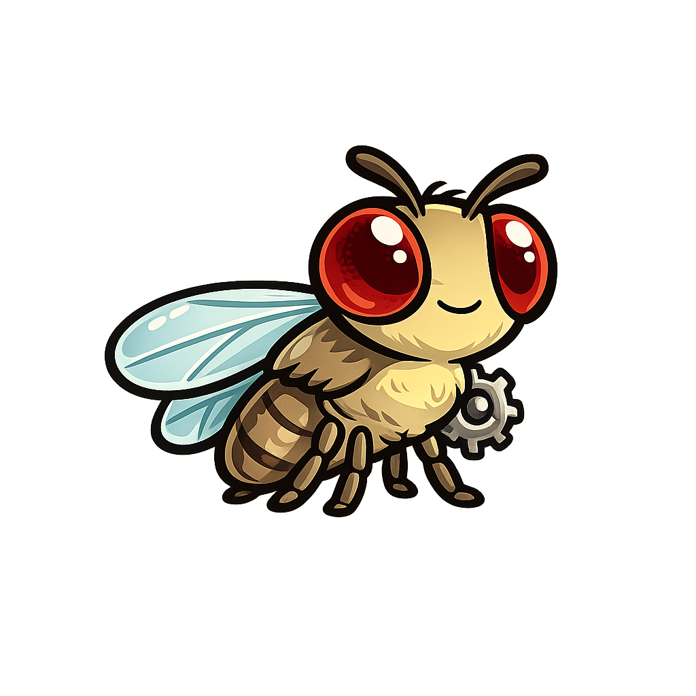
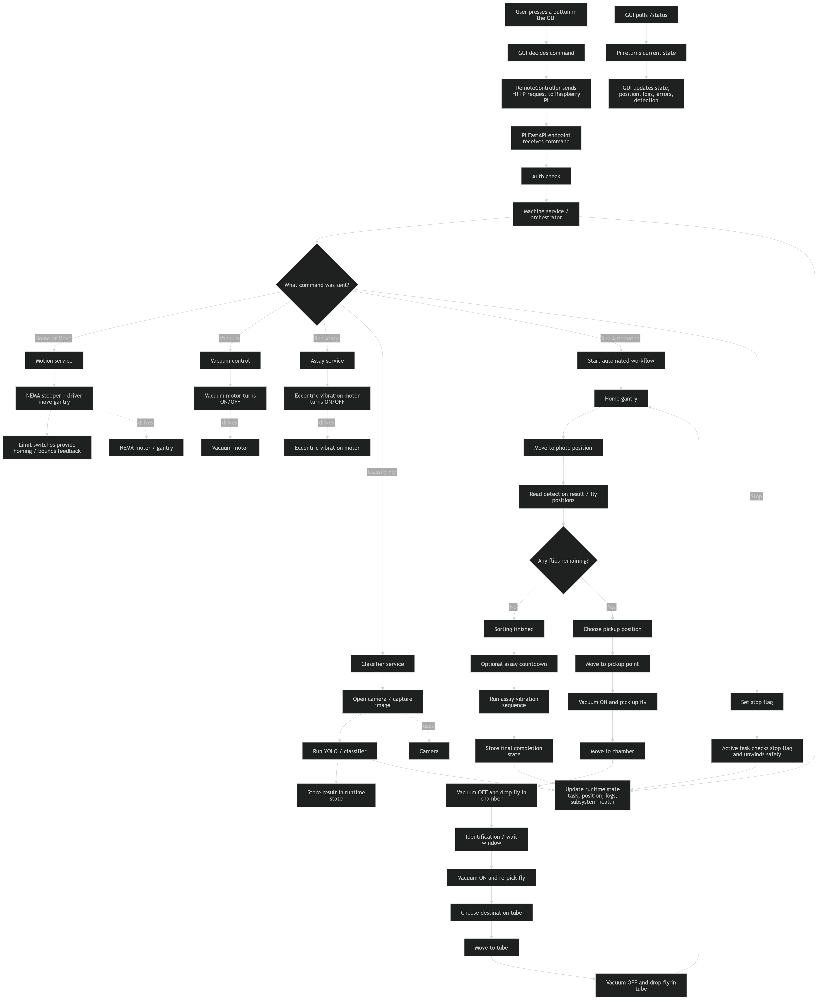
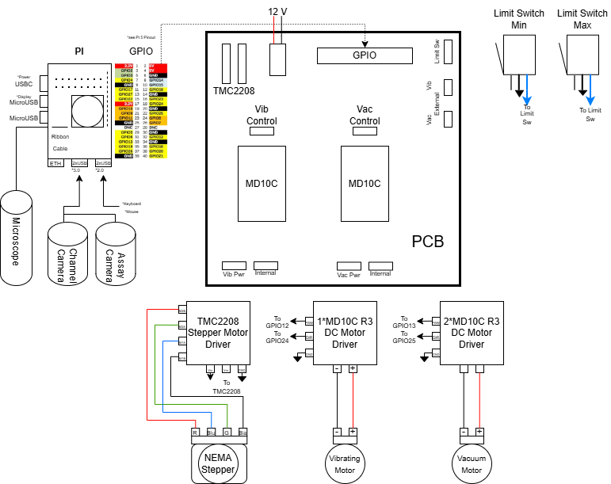
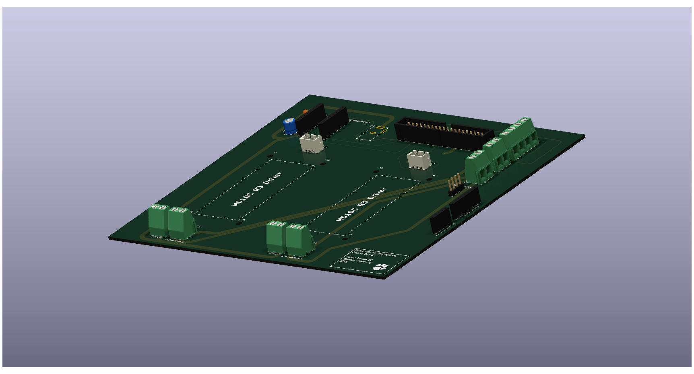

# Automated Drosophila Sorting System 

**Automated Drosophila Sorting System** is a mixed hardware, embedded-control, computer-vision, and desktop-software project for detecting, picking, classifying, and sorting **Drosophila melanogaster** with minimal operator intervention.

This repository contains the actual working project code:

- **Raspberry Pi machine control**
- **Desktop GUI control**
- **Computer vision and channel-detection code**
- **Backend API and runtime-state architecture**
- **Control, vision, and support modules used by the system**

It should be read as a real electromechanical system codebase, not just a GUI project and not just an API project.

## **Overview**

The system is designed to automate the pipeline from mixed fly input to classified tube output.

**Intended operating loop:**

1. Flies are loaded into the channel.
2. A camera captures the channel image.
3. Computer vision detects fly positions.
4. The system selects the next target.
5. The gantry moves to the pickup location.
6. Vacuum captures the fly.
7. The fly is moved to an identification chamber.
8. Classification or assay logic runs.
9. The fly is placed into the correct output tube.
10. The gantry returns home/reset.
11. The cycle repeats until no flies remain.

**Target system goals:**

- `>= 4` flies processed per minute
- `>= 99%` survival rate
- `< 1%` sorting error
- Continuous operation across roughly `20` output tubes without intervention

## **System Architecture**

### **Hardware Layer**

The hardware stack includes:

- **Raspberry Pi 5** or similar Pi-class controller
- **X-axis gantry**
- **NEMA stepper motor**
- **TMC2208 stepper driver**
- **Vacuum pickup system**
- **Eccentric vibration motor**
- **Limit switches** for homing/reference
- **Top-down camera**
- **Custom PCB support** for motor-driver interfacing, power distribution, and GPIO breakout/control

### **Software Layer**

The software stack includes:

- **Python-based control** on the Raspberry Pi
- **Motion control** and homing logic
- **Vacuum and vibration control**
- **Computer vision / detection pipeline**
- **Desktop GUI** for operator interaction
- **FastAPI backend** for remote operation
- **Shared runtime state** and controller abstractions

### **Responsibility Split**

The repository is structured around this separation:

- **Pi backend**
  - Owns hardware control
  - Owns runtime truth
  - Executes machine tasks
  - Exposes API endpoints

- **Host GUI**
  - Owns operator interaction
  - Sends commands to the Pi
  - Polls backend state
  - Displays logs, status, actuator state, and preview data

**Communication model:** FastAPI + HTTP in remote mode.

## **System Functions**

The system provides the following functions in the codebase:

- **Remote GUI control** from host to Pi
- **Homing**
- **Manual movement**
- **Vacuum control**
- **Vibration control**
- **Classify requests** through the controller/API path
- **Assay requests** through the controller/API path
- **Reconnect and retry handling**
- **Remote calibration confirmation** before controls unlock
- **Remote preview image fetch** from Pi-generated artifacts
- **Degraded backend startup** when some subsystems are unavailable
- **Local / simulation-capable behavior** preserved
- **Manual control validated on real hardware**

## **How It Works**

**Remote-mode flow:**

`GUI -> Controller -> FastAPI API -> Machine Service -> Hardware / CV logic -> Runtime State -> GUI`

### **System Workflow Diagram**

<p align="center">
  
</p>

**Operationally:**

1. The operator launches the GUI.
2. The GUI connects to the Pi backend.
3. The GUI requires a home calibration confirmation before remote controls unlock.
4. Commands are sent through a controller abstraction.
5. The Pi backend validates and executes the task.
6. Backend state is updated as the task progresses.
7. The GUI polls `/status`.
8. The GUI updates position, state, logs, actuator status, and preview display.

## **Repository Structure**

This repository contains the backend, GUI, shared definitions, hardware-control code, and vision code that make up the working system.

```text
geneticsdrosophiliaproject/
|- .github/
|  `- assets/
|     |- Complete3-D ModelM2.png
|     |- Drosophilia_Core_PCB_2.png
|     |- Full-System-Integration.png
|     `- drosophila.png
|- README.md
|- assets/
|- CodeDirectory/
|  |- gui.py
|  |- config.py
|  |- motion.py
|  |- gantryOperation.py
|  |- nozzle_implementation.py
|  |- vacuum.py
|  |- vibration.py
|  |- assay.py
|  |- fly_classifier.py
|  |- launch_gui.bat
|  |- launch_gui.sh
|  `- launcher/support files
|- fin6/
|  |- fly_tracking_gui.py
|  |- brio_channel_cli.py
|  |- fly_x_detector.py
|  |- run_detection_once.py
|  |- assay_tracking.py
|  |- camera_sources.py
|  `- outputs/
|- host_app/
|  |- controllers/
|  `- sync/
|- pi_backend/
|  |- adapters/
|  |- api/
|  |- control/
|  `- core/
|- shared/
|  |- config/
|  `- state/
`- supporting scripts / notebooks / prototypes
```

## **Codebase Breakdown**

### **`CodeDirectory/`**

This directory contains the main desktop GUI and several core control modules used by the system.

**Important files:**

- **`gui.py`**
  - Main desktop GUI
- **`motion.py`**
  - Low-level gantry motion logic
- **`gantryOperation.py`**
  - Higher-level gantry movement / sorting flow logic
- **`vacuum.py`**
  - Vacuum actuation
- **`vibration.py`**
  - Vibration actuation
- **`assay.py`**
  - Assay-related routines
- **`fly_classifier.py`**
  - Classification integration

### **`pi_backend/`**

The Raspberry Pi backend architecture.

**Subdirectories:**

- **`api/`**
  - FastAPI app, routes, auth, models
- **`core/`**
  - Runtime state, config, logging bridge
- **`control/`**
  - Machine service, assay service, classify service
- **`adapters/`**
  - Motion, vacuum, vibration, and detection/result adapters

### **`host_app/`**

Host-side support code for remote GUI operation.

**Subdirectories:**

- **`controllers/`**
  - Base controller
  - Local controller
  - Remote controller
- **`sync/`**
  - Connection state
  - Remote polling/sync logic

### **`shared/`**

Shared project definitions used by both sides.

**Includes:**

- Machine path definitions
- Network config
- Shared state enums

### **`fin6/`**

Computer vision and channel-detection code.

**Important files:**

- **`fly_tracking_gui.py`**
- **`brio_channel_cli.py`**
- **`fly_x_detector.py`**
- **`run_detection_once.py`**
- **`assay_tracking.py`**
- **`camera_sources.py`**

This area handles:

- Detection result generation
- Annotated preview image generation
- Channel output artifacts
- Camera integration support

## **Computer Vision / Output Artifacts**

Important generated files include:

- **`fin6/outputs/channel/last_channel_result.json`**
- **`fin6/outputs/channel/last_channel_annotated.png`**
- **`fin6/outputs/channel/last_channel_mask.png`**

These are used for:

- Fly-position detection output
- Annotated preview display
- Remote GUI preview fetch from the Pi

## **API Endpoints**

Current backend endpoints include:

- **`GET /health`**
  - Backend liveness and subsystem readiness
- **`GET /status`**
  - Full runtime state for the GUI
- **`GET /artifacts/channel/annotated`**
  - Latest annotated channel preview image
- **`POST /home`**
  - Home the gantry
- **`POST /move_absolute`**
  - Move to an absolute position
- **`POST /move_relative`**
  - Move by a relative distance
- **`POST /vacuum`**
  - Turn vacuum on/off
- **`POST /vibration`**
  - Turn vibration on/off
- **`POST /classify`**
  - Run classification workflow
- **`POST /run_assay`**
  - Run assay workflow
- **`POST /stop`**
  - Request stop of the active backend task

## **Dependencies**

The dependency list below is based on the project code under:

- `CodeDirectory/`
- `pi_backend/`
- `host_app/`
- `shared/`
- `fin6/`

It excludes unrelated one-off scripts and notebooks outside the main Drosophila system flow.

### **Core Backend**

- **Python 3.10+**
- **fastapi**
- **uvicorn**
- **pydantic**

### **Hardware / Raspberry Pi**

- **gpiozero**
- **lgpio**
- **picamera2**

### **Computer Vision / ML**

- **opencv-python**
- **numpy**
- **ultralytics**

### **GUI / Client**

- **tkinter**
- **requests**
- **Pillow**

### **Vision / Analysis Utilities**

Used by the `fin6/` tooling and analysis flows:

- **pandas**
- **scipy**
- **matplotlib**

### **Notes**

- The **Pi backend** requires hardware-facing dependencies.
- The **host remote GUI** should not require Pi GPIO libraries.
- **Local mode / simulation** uses a broader local dependency stack than pure remote host mode.
- Some `fin6/` workflows use a wider scientific Python stack than the minimal remote GUI path.

## **Safety Notes**

- Always home before relying on positional accuracy.
- Remote operation requires calibration/home approval before controls unlock.
- Be ready to stop the system if motion or actuator behavior is incorrect.
- Prevent collisions and overtravel.
- Do not leave vacuum active longer than necessary.
- Treat timing as a real mechanical constraint.
- Hardware safety matters more than convenience.

## **Design Constraints**

Code changes should respect the following:

- This is a **state-driven system**, not just a script.
- Movement and delays are **physically real**.
- **Deterministic behavior** matters.
- **Hardware is the source of truth**.
- **Homing is foundational** for accurate movement.
- Blocking or nondeterministic control behavior should be minimized.

## **Known Issues / Current Gaps**

- The full automated sorting loop is not yet fully exposed through the Raspberry Pi backend.
- Some working behaviors use direct local control modules in addition to the backend/client split.
- GPIO environment setup can be sensitive on some Pi systems.
- YOLO / detection performance varies with lighting and camera conditions.
- Classification accuracy and throughput need refinement.
- Deployment and service management are not yet fully standardized.

## **Physical System Reference**

The images below provide physical context for the hardware and mechanical system represented by the codebase.

### **Wiring Diagram**

<p align="center">
  
</p>
<p align="center">
  <em>System wiring diagram showing the Raspberry Pi, PCB implementation, motor driver, vacuum and vibration drivers, cameras, and limit-switch connections.</em>
</p>

- **Important note:** the limit switches are shown as `GND`, but they are connected to **3V3** because the system uses a **logic-high** limit-switch input.
- The limit-switch wiring lands on the right-side Phoenix terminal labeled **LimitSwitches**.

### **Core PCB**

<p align="center">
  
</p>
<p align="center">
  <em>Render of the core PCB used for motor-driver interfacing, power distribution, and control connectivity.</em>
</p>

### **3D Printed Assembly Model**

<p align="center">
  
</p>
<p align="center">
  <em>Exploded 3D model of the printed and assembled hardware system showing the major mechanical components and part layout (items 1-14).</em>
</p>

## **Project Team**

**Repository Ownership**

Primary GitHub Contributor/Owner: Camren J. Khoury

**Contributions**

**Mechanical Systems**
- 3D Modeling/Printing: **Rivers Henderson**, Dylan Britch, Ainara Garcia
- Vacuum Nozzle Development: **Dylan Britch**, Rivers Henderson, William McGlone, Megan McNuer, Ainara Garcia

**Electrical Systems**
- PCB Design: **Camren J. Khoury**
- Wiring and Schematics: **William McGlone**, Camren J. Khoury, Megan McNuer

**Embedded & Control Systems**
- Motor Control: **William McGlone**, Camren J. Khoury, Megan McNuer, Dylan Britch
- Raspberry Pi and GPIO Control: **Camren J. Khoury**

**Software & Computational Systems**
- Computer Vision Code: **Avi Patel**, Dylan Britch
- Database Creation: **Ainara Garcia**, Dylan Britch, Avi Patel
- Networking and Automation: **Camren J. Khoury**

**Systems Integration**
- Integration: **Camren J. Khoury**, William McGlone

**Project Management & Operations**
- Logistics: **Megan McNuer**, William McGlone
- Student Project Manager: **Ainara Garcia**

### **Academic / Institutional Associations**

#### **Clemson University Institute for Genetics**

- Dr. John Poole
- Dr. Anurag Chaturvedi

#### **Holcombe Department of Electrical and Computer Engineering**

- Dr. Hassan Raza

## **License**

License to be added.
